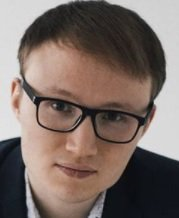

# Kochetkov Maxim
### Contacts:
##### phone: +7 (951) 1993564 
##### email: maximlebedev@live.com — preferred communication method
##### discord-name: Maxim Kochetkov (@maxkochetkov)
### About me:
##### Man, 27 years old, born July 11, 1994
##### Residence: Izhevsk
##### Citizenship: Russia, have a work permit: Russia
##### At the moment I am engaged in maintenance of the software product "1C Enterprise Accounting 8". Began to master HTML, CSS, JS.
## Career objective: Junior js delovoper
### Skills:
* html basics  
* css basics
* js basics
* git basics 
### Additional Information:
* Knowledge at the level of the administrator OC Windows 7-10
* Understanding how server operating systems work
* Confident user of BT diagnostics software
* Knowledge of the structure of the PC, the ability to repair VT equipment
* Installation and diagnostics of LAN
* Efficiency, consistency of thinking
* High speed of work
* Stress resistance
* Responsibility for achieving the result
* Improving IT knowledge
* Active life position
### English
* A - Basic User

